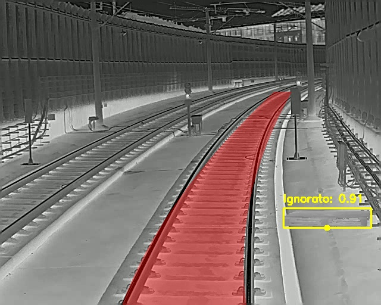

# Thermal Rail Segmentation & Object Detection Pipeline

Computer Vision pipeline designed for automated infrastructure segmentation and anomaly detection on thermal/infrared video streams. 
This project integrates state-of-the-art Deep Learning models to extract track masks and identify obstacles in low-visibility environments.

Developed as a Bachelor's Thesis project in Computer Engineering.

## 🎯 Architecture & Tech Stack
* **Goal:** High-accuracy segmentation of railway tracks and bounding box localization of potential hazards.
* **Core Models:** 
  * Fine-tuned **Ultralytics YOLO** for fast, real-time object detection.
  * **SAM 2 (Segment Anything Model 2)** with a custom adapter, fine-tuned for thermal domain prompt-based mask generation.
* **Stack:** Python, PyTorch, OpenCV, NumPy, CUDA.

---

## 📸 Demo & Results

### 1. Spatial AND Logic (Ideal Conditions)
The pipeline successfully merges YOLO bounding boxes with SAM 2 segmentation masks. Objects detected *inside* the track mask are flagged as **CRITICAL**, while objects *outside* are flagged as **Ignored**.



### 2. Zero-Shot Real-World Inference (WIP)
Testing the pipeline on out-of-distribution (OOD) field video streams.


#### 🔍 Engineering Analysis & Known Limitations
The model demonstrates high precision on the validation set, but encounters specific edge cases during zero-shot real-world video inference:
* **Domain Shift:** The field video contains environmental variations and thermal noise not present in the training distribution.
* **Temporal Consistency:** Inference is currently performed frame-by-frame, causing minor flickering in the segmentation masks.
* **Next Steps:** Implementing multi-object tracking (e.g., DeepSORT or ByteTrack) and expanding the dataset with diverse field-recorded sequences to stabilize the output temporally.

---

## 📁 Repository Structure
```text
thermal-rail-segmentation/
├── configs/                  # YAML configuration files for training/inference
├── data/sample/              # Sample thermal images and ground truth masks
├── src/                      # Source code (Custom SAM2 Adapter & YOLO scripts)
│   ├── train.py              # Custom training loop with RandomErasing & MultiStepLR
│   ├── batch_inference.py    # E2E inference script (Detection + Segmentation)
│   ├── datasets.py           # Dataloader logic
│   └── wrappers.py           # Dataset wrappers with custom augmentations
└── README.md